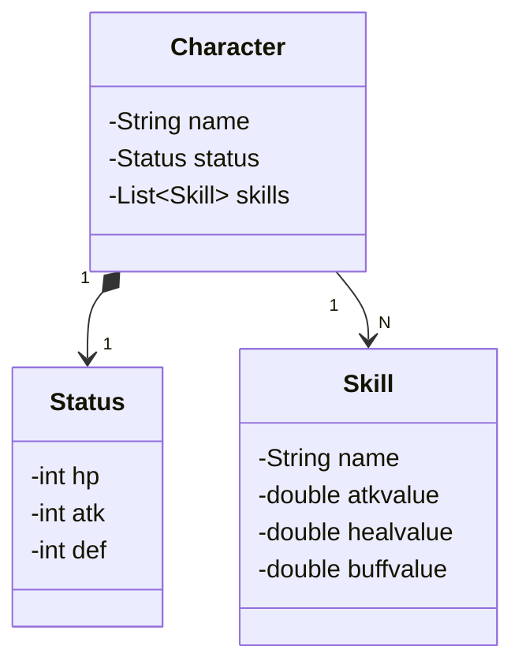

# Projeto API RESTful
Projeto de uma API RESTful com Springboot, Gradle.

## Diagrama de Classes

```mermaid

classDiagram
class Character {
    -String name
    -Status status
    -List~Skill~ skills
}

class Status {
    -int hp
    -int atk
    -int def
}

class Skill {
    -String name
    -double atkvalue
    -double healvalue
    -double buffvalue
}

Character "1" *--> "1" Status
Character "1" --> "N" Skill

```
